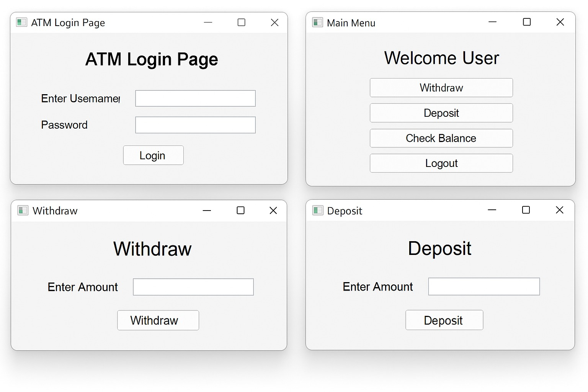

# ATM Machine

A Java-based **ATM Management System** developed using **Java Swing** and **MySQL** using **NetBeans IDE**. This project simulates the basic functionalities of an Automated Teller Machine through a user-friendly graphical interface.

## Features

* User Login
* Deposit Money
* Withdraw Money
* Check Account Balance

## Technologies Used

* Java
* Java Swing
* MySQL (`atm_db`)
* NetBeans IDE

## Project Screenshot

## How to Run

1. Open the project in NetBeans IDE.
2. Import the `atm_db` database into MySQL.
3. Update the database connection details if required.
4. Build and run the project.
5. Log in and use the available ATM features.

## Future Enhancements

* PIN Change
* Fund Transfer
* Transaction History
* Mini Statement
* Improved User Interface

## Author

**Vaibhavi Banarase**

